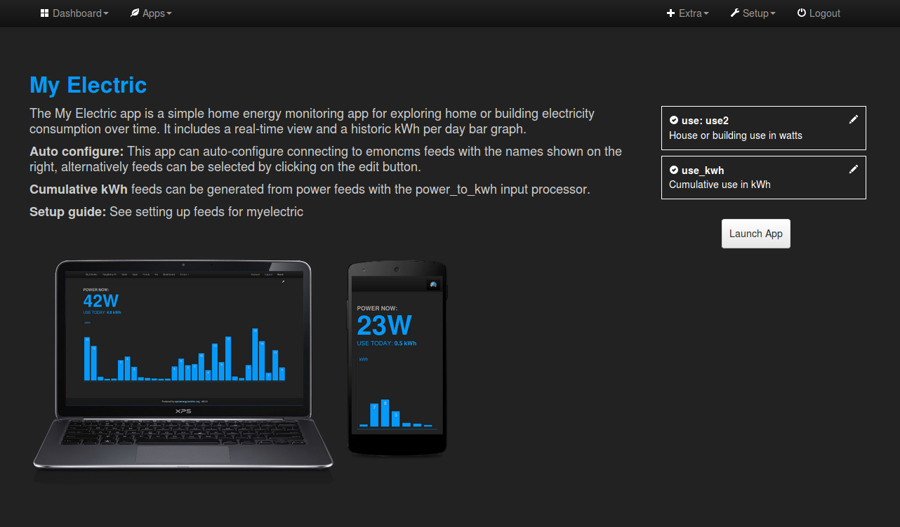
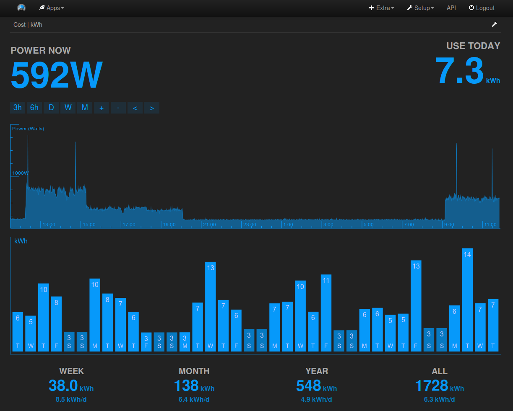
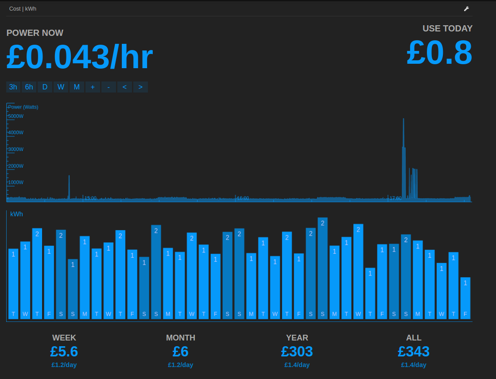

# Home Energy Monitoring

The OpenEnergyMonitor system can be used as a simple home energy monitoring system for understanding energy consumption.

- View and explore real-time power and daily energy consumption in kWh.
- MyElectric is a web app which runs on [Emoncms](https://Emoncms.org). 
- MyElectric is also available as a native [Android app](https://play.google.com/store/apps/details?id=org.emoncms.myapps&utm_source=global_co&utm_medium=prtnr&utm_content=Mar2515&utm_campaign=PartBadge&pcampaignid=MKT-Other-global-all-co-prtnr-py-PartBadge-Mar2515-1)


## 1. Required Hardware

See Home Energy Monitor tab of [Setup > Required Hardware](../emonpi/install.md)

*The Emoncms setup instructions below are applicable to both the emonPi and the emonTx where CT1 is site consumption. If using an emonTx substitute the 'log to feed' instructions to use an input from the emonTx instead of emonPi.*

## 2. Sensor Installation

See [Setup > Install](../emonpi/install.md) section of the setup guide.

```{warning}
[Please read the CT installation guide before installing.](../electricity-monitoring/ct-sensors/installation.md)
Your safety is your responsibility. Clip-on current sensors are non-invasive and should not have direct contact with the AC mains. However, installing the sensors will require working in close proximity to cables carrying high voltage. As a precaution, we recommend ensuring the cables are fully isolated, i.e. power is switched off, prior to installing your sensors, and proceeding slowly with care. If you have any doubts, seek professional assistance.
```

```{note}
The clip-on CT sensors must be clipped round either the live or Neutral AC wire. <strong>Not both</strong>.
```


```{note}
The polarity of the power readings depends on the orientation of the clip-on CT sensor. Orientate the CTs so that site-consumption is positive. The correct orientation can be determined by trial and error.
```


## 3. Emoncms Feed Setup

See [Emoncms > Log Local](../emoncms/intro-rpi.md) section of the setup guide.

For automatic MyElectric App setup use the suggested feed names below. **The names are case sensitive.**

> Assuming CT1 (power 1) = site-consumption*

 1. Click on spanner icon to configure `emonPi/power1`.
 2. Select `log to feed` and create a feed called `use` with the feed engine set to PHPFina and feed `interval=10s`.
 3. Select `power to kwh`, create a feed called `use_kwh` with feed engine `PHPFina` and feed `interval=10s`.

## 4. Configure MyElectric App

With your emonPi or emonTx inputs configured as above and with use of the suggested feed names the MyElectric app will launch with no further configuration required.

Alternatively the MyElectric app will automatically show the configuration screen if it can't detect the expected feeds. It's then possible to select feeds from the drop down feed selector menus:

Once the required feeds are selected, the Launch App button will appear.



## My Electric App 

The main view shows a moving window power view of site-consumption in the top half and historic daily energy consumption in kWh in the bottom half.

**Energy View**



**Cost View**




