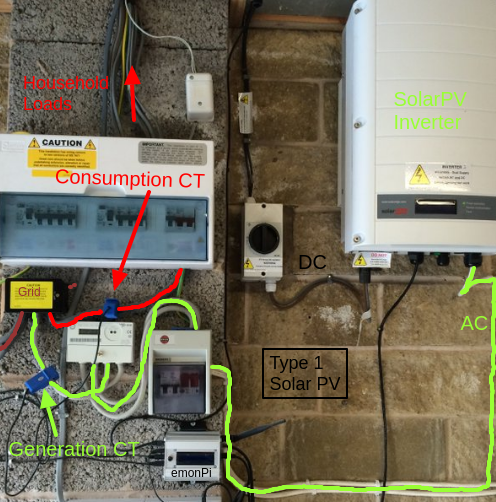
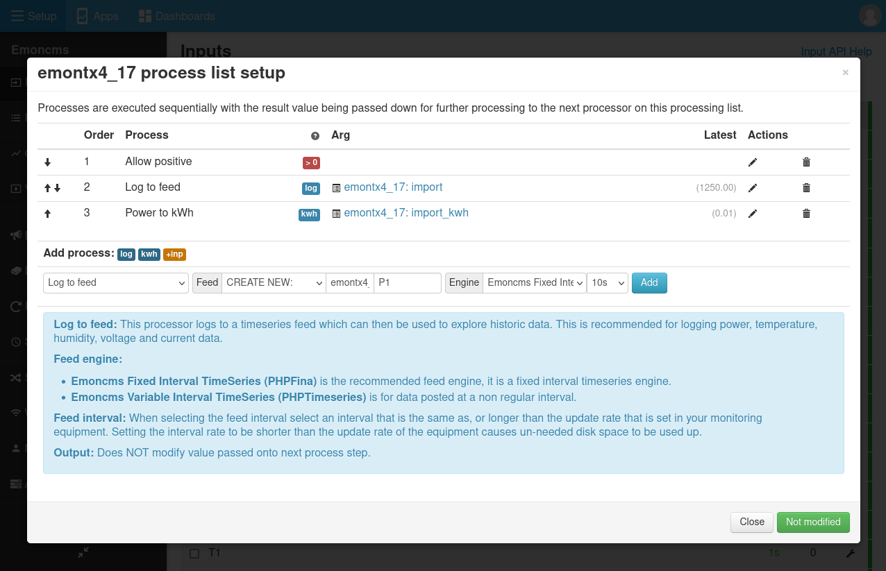
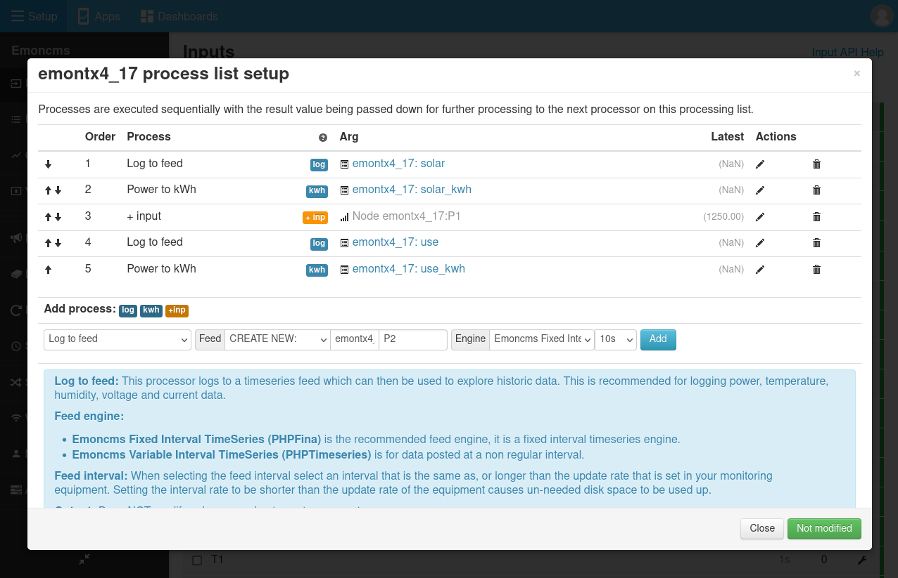
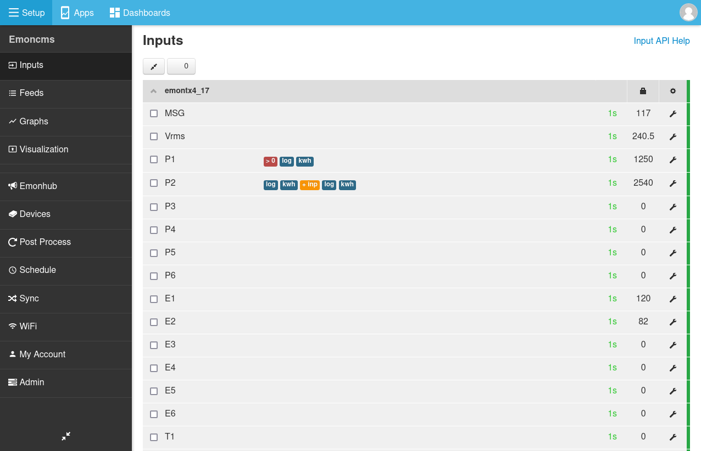
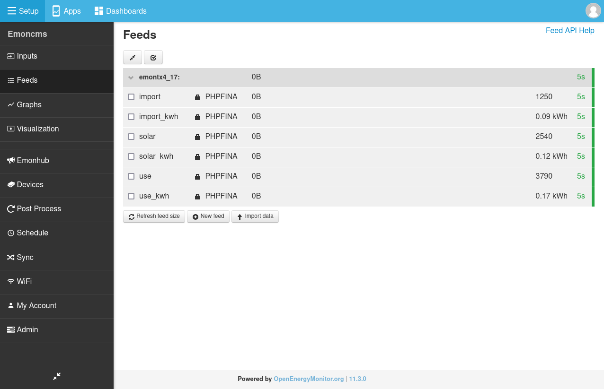
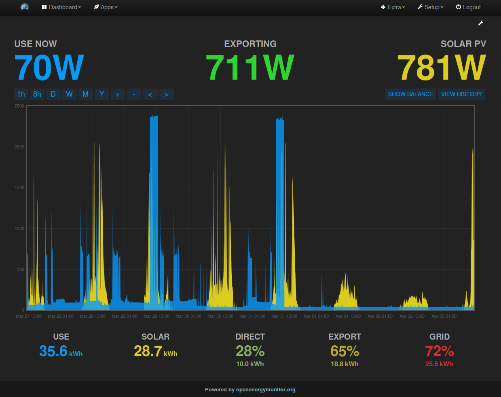
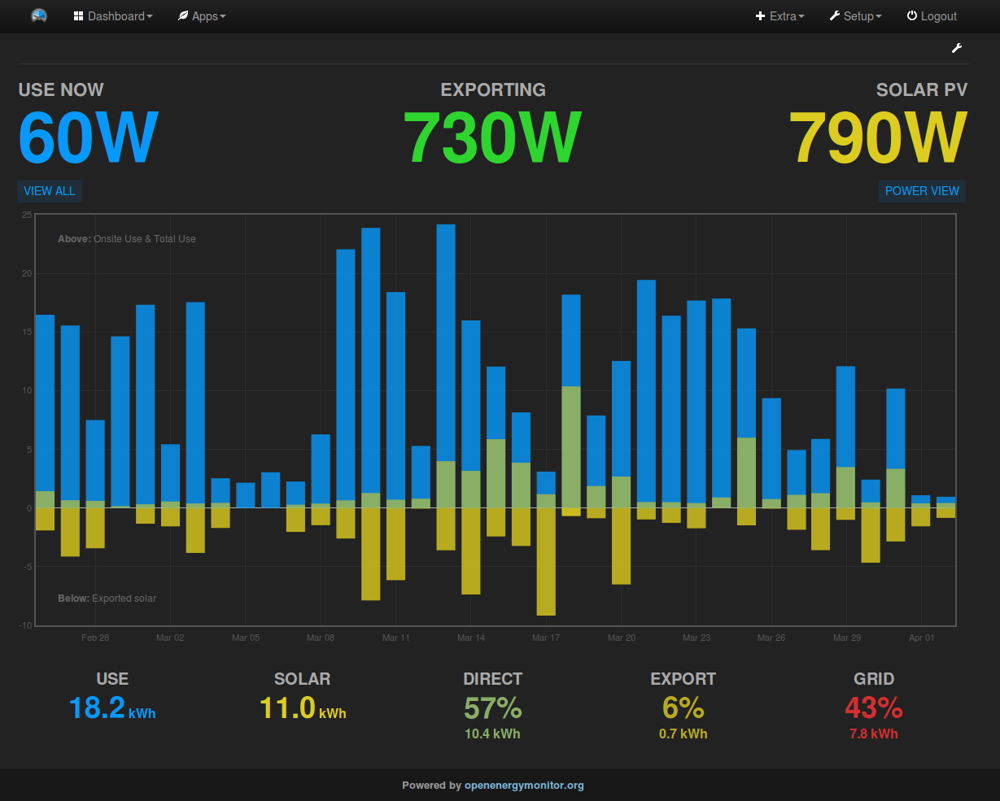

<a class="btn" href="https://shop.openenergymonitor.com/single-phase-6-channel-energy-monitoring-emontx-v4/">Buy in Shop</a>

# Solar PV

<!--<p><a class="btn pull-right" href="http://shop.openenergymonitor.com/emonpi-solar-pv-bundle/">View in Shop</a></p>-->

The OpenEnergyMonitor Solar PV monitor provides real-time and historic information on solar generation on on-site consumption.

My Solar is a dashboard app which runs on Emoncms.

Emoncms and My Solar are pre-installed on the emonBase/emonPi base-station and can be used locally and/or data can be posted to our remote emoncms server [Emoncms.org](https://emoncms.org)


**Explore, visualise:**

 - Solar PV generation
 - Site-consumption
 - Solar PV generation used on-site (self-site-consumption)
 - Solar PV generation exported to the grid
 - Electricity imported from the grid
 - Real-time & historic daily, monthly and annual totals

## 1. Hardware

**emonTx4**<br>
Our latest energy monitoring unit is called the emonTx4. With 6x clip-on CT sensor channels it can be used to monitor the main supply, solar generation and several other circuits in a house. 

The emonTx4 also measures voltage using the emonVs precision voltage sensor and power supply. Voltage sensing ensures accurate measurement of active power, which is what is usually billed for.

For a more detailed overview of the emonTx4, please see: [EmonTx4: Overview](../emontx4/overview.md).

The emonTx4 can be used in two configurations: 

1\. The emonTx4 transmits it's measurement data via a 433 MHz radio link to an emonBase base-station, which is then either connected to the local network via WiFi or Ethernet. This provides full local data logging and visualisation capability - as well as the option to forward the data to a remote server. For more information, please see:

- [emonTx4, emonVs & emonBase installation guide](../emontx4/emontx4_emonbase_install.md)
- [emonTx4 shop item](https://shop.openenergymonitor.com/6-channel-energy-monitoring-emontx-v4)

2\. The emonTx4 can alternatively used in stand-alone mode with a WiFi adapter board. This is more suited for data logging on a remote server such as our [emoncms.org](https://emoncms.org) service. For more information, please see:

- [emonTx4 ESP8266 Wi-Fi Expansion Board](https://docs.openenergymonitor.org/emontx4/expansion_boards.html#adafruit-esp8266-huzzah-wi-fi-expansion-board)
- [emonTx4 WiFi shop item](https://shop.openenergymonitor.com/emontx-v4-with-onboard-wifi/)

## 2. Sensor Installation

*The following image shows our original emonPi energy monitor, the same CT configuration options are applicable for our latest emonTx4 hardware as well.*


It is important that a voltage sensor is used for solar PV monitoring. 

```{warning}
[Please read the CT installation guide before installing.](../electricity-monitoring/ct-sensors/installation.md)
Your safety is your responsibility. Clip-on current sensors are non-invasive and should not have direct contact with the AC mains. However, installing the sensors will require working in close proximity to cables carrying high voltage. As a precaution, we recommend ensuring the cables are fully isolated prior to installing your sensors, and proceeding slowly with care. If in doubt, seek professional assistance.
```

```{note}
The clip-on CT sensors must be clipped round either the Line or Neutral AC wire, **Not both**.
```

*While the images below show the original blue CT sensors, our latest CT sensors for the emonTx4 are different in appearence but the principle of the image is the same.*


<!--  -->

**Type 1 solar PV System:** The generation and site-consumption **can** be monitored separately. The amount exported/imported to or from the grid is the difference between generation and site-consumption.

*Type 1 system:  Grid (import/export) = site-consumption – Generation*

Connect CT's are follows: 

- CT1 (power 1) = site consumption.
- CT2 (power 2) = solar generation.

**Type 2 solar PV System:** When the generation and import can be monitored separately, but site-consumption **cannot**, for example where:

* the PV inverter output is fed into the fuse box (consumer unit) and the household loads are connected to other circuits in the same fuse box, or
* It's physically difficult to attach a CT sensor to anywhere after the import and generation supplies meet (e.g. to the meter tails from the junction point to the fuse box).

Connect CT's as follows:

- CT1 (power 1) = grid import (positive) and export (negative).
- CT2 (power 2) = solar generation.

*Type 2 system:  Site-consumption = Generation + Grid import (negative when exporting)*

**All solar PV systems can be monitored using the Type-2 method; it's highly recommended to use this method.**

```{note}
The polarity of the power readings depends on the orientation of the clip-on CT sensor. Orientate the CTs so that generation and site-consumption is positive and grid import/export is <b>positive when importing and negative when exporting</b>.
```

## 3. Configure Feeds

With the emonTx4 hardware setup, you should now see the emonTx4 inputs on the emoncms inputs page:


### Type 2 Configuration

**Power 1 (P1) configuration:** The Power 1 input is measuring grid import (positive values) and grid export (negative values). Configure this input to record imported consumption only. To do this, use the `Allow positive` input process and then log the result to a feed using the `Log to Feed` input process. Process the power data into a cumulative kWh value using the `Power to kWh` input process.

Click on the spanner icon next to the right hand side of the input to open the input processing configuration window for the P1 input. Select the Emoncms Fixed Interval feed storage engine and 10s feed interval when creating the feeds. The result should look like this:



**Power 2 (P2) configuration:** The Power 2 input is measuring solar generation (positive values). Configure this input to record solar generation and then sum with the grid import/export value to calculate total house consumption. Start by recording the solar generation power value with `Log to Feed`, then the cumulative solar generation kWh value using `Power to kWh`. Then add the grid import/export value using the `+ input` input process, the result passed back is now total house consumption. Finally record the result with `Log to Feed`, and a cumulative consumption kWh value using `Power to kWh`.

Again, select the Emoncms Fixed Interval feed storage engine and 10s feed interval when creating the feeds. The result should look like this:



The resulting input list looks like this:



and feed list:



Video guide for solar PV Feed & My Solar App Setup, recorded for the emonPi and on an earlier version of Emoncms but the overall process is the same with our latest hardware.

<div class='videoWrapper'>
<iframe width="560" height="315" src="https://www.youtube.com/embed/Nc6YSWqqxkA" frameborder="0" allowfullscreen></iframe>
</div>
<br>

## 4. My Solar Emoncms App

Once setup is complete click on `Apps > My Solar` in order to launch the My Solar Emoncms app. The My Solar app should automatically detect the solar PV feeds.


### Configure My Solar App power view

Site-consumption is shown in blue and solar generation in yellow. The totals at the bottom of the page relate to the current window selected and show at a glance how much of site-consumption was supplied directly from solar and how much of the solar generation was exported to the grid.



Clicking on view history brings up a bar graph showing solar generation and site-consumption on a daily basis. Including how much of the solar generation is used directly on site and how much is exported.


