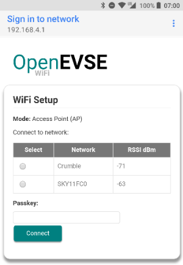
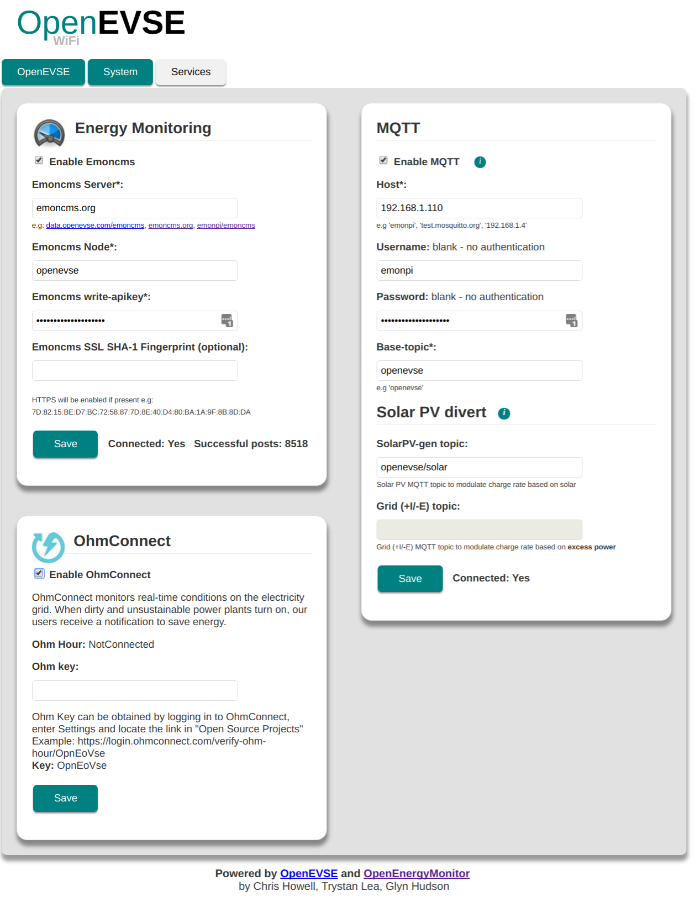
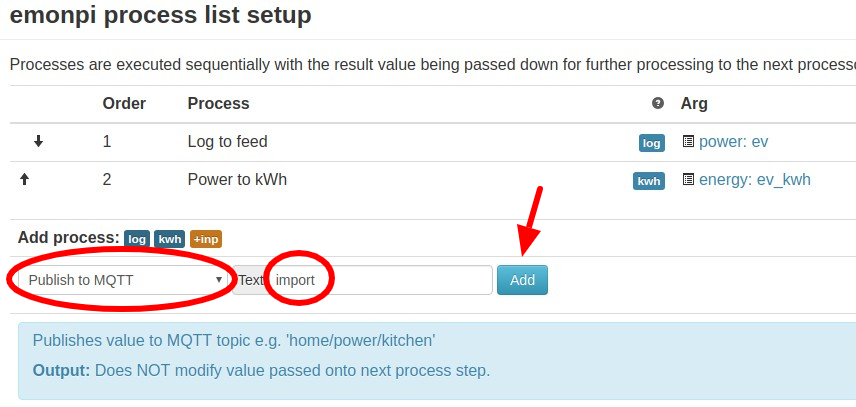
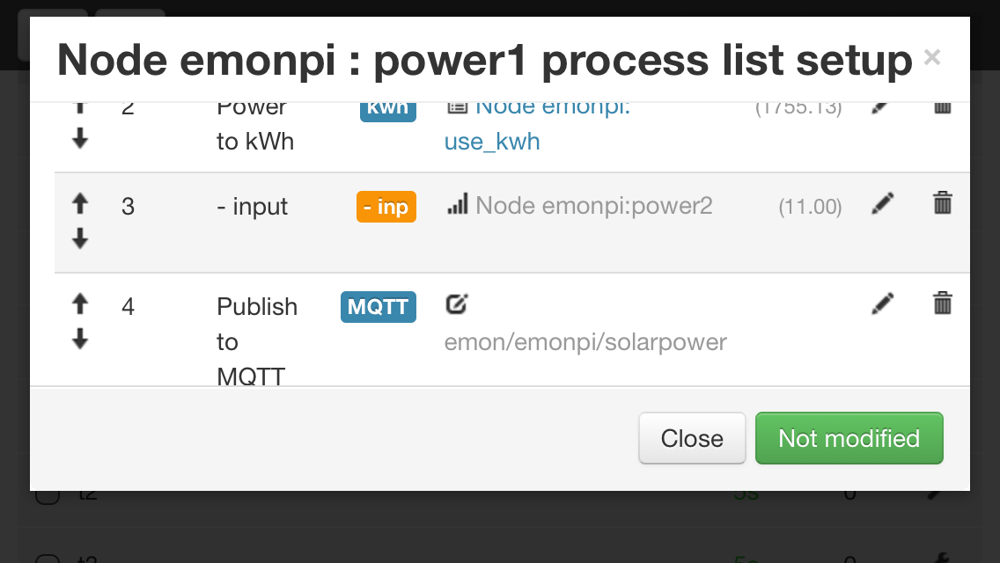
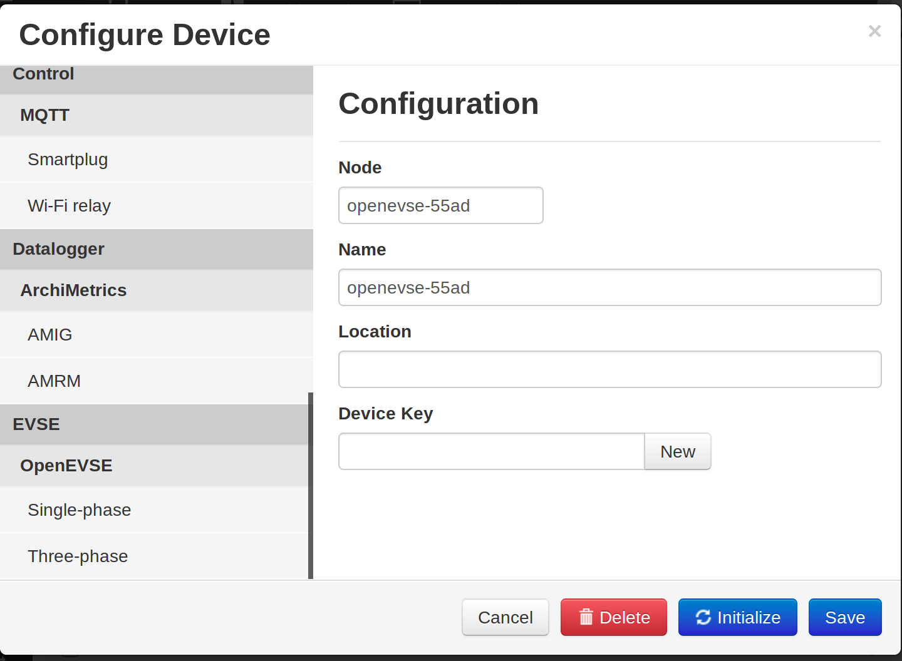
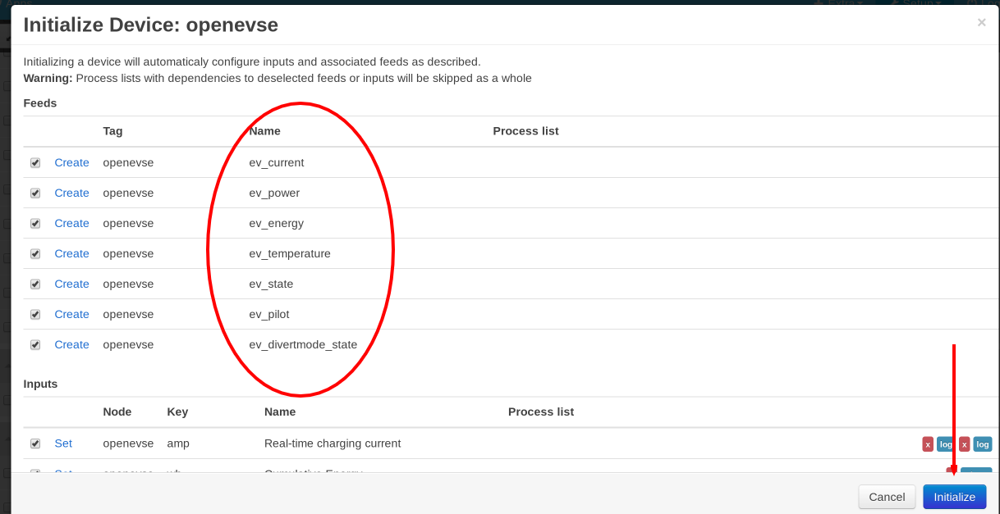
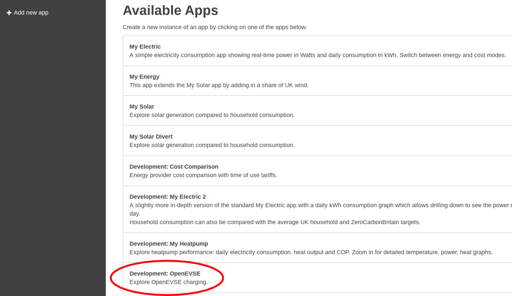
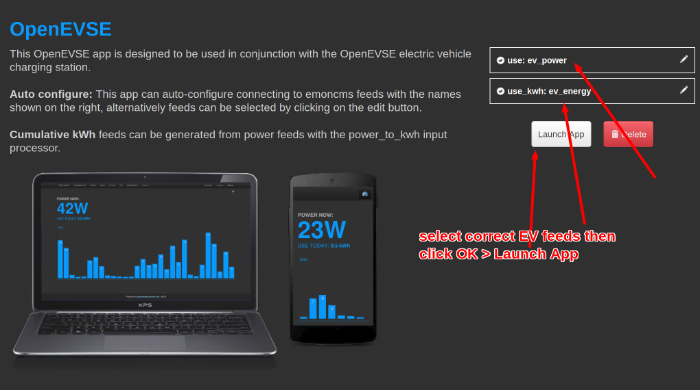
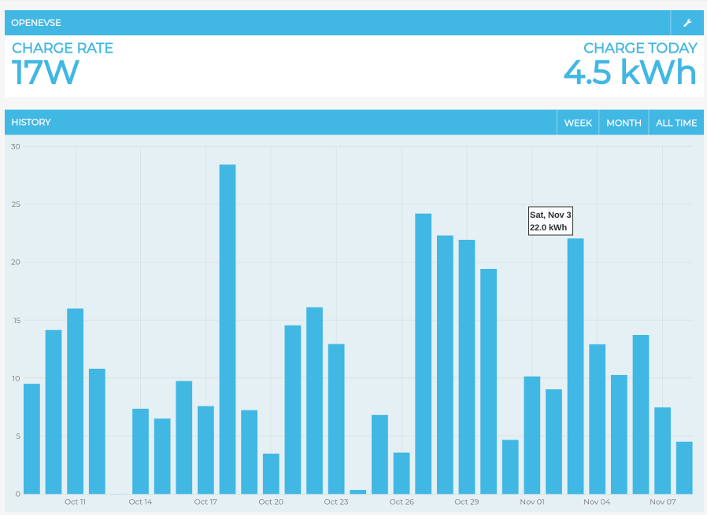
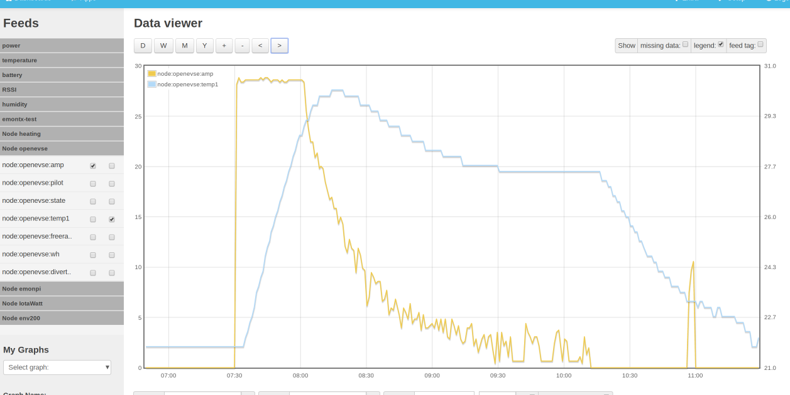

# OpenEVSE / EmonEVSE Setup Guide

<div class='videoWrapper'>
<iframe width="560" height="315" src="https://www.youtube.com/embed/WJtNEPrSSvg" frameborder="0" allowfullscreen></iframe>
</div>

```{note}
OpenEVSE and EmonEVSE share the same software platform, both these units are configured and setup in the same way, "OpenEVSE" and "EmonEVSE" will be used interchangeably in this guide.
```

## Web Interface Setup

All functions of the EVSE can be controlled via the web interface, see [https://openevse.openenergymonitor.org](https://openevse.openenergymonitor.org) for a live demo. This interface is optimised to work well on a mobile device. 

<div class='videoWrapper'>
<iframe width="300" height="169" src="https://www.youtube.com/embed/OAjlKmyRJMk" frameborder="0" allowfullscreen></iframe>
</div>

### WiFi Setup


- Once powered up connect to WiFi network with SSID `OpenEVSE_xxxx` with password `openevse` using a computer or mobile device.

- You should get directed to a captive portal where you choose to join a local network. If captive portal does not work, browse to [http://192.168.4.1](http://192.168.4.1)



### Services Setup



#### Emoncms Server Setup

```{note}
Emoncms server (HTTP) and MQTT both post the same status updates. Emoncms server and MQTT should not be connected to the <i>same emonPi</i>, since this will result in duplicate data. However, it is possible to use MQTT to post data to a local emonPi and Emoncms to post to a remote server e.g emoncms.org.  
```

OpenEVSE can post data directly to an Emoncms server via HTTP(S), enter the following:

- Emoncms server url e.g [emoncms.org](https://emoncms.org)
- Node-name is the name given to the OpenEVSE data in Emoncms Inputs
- Write API key, obtained from Emoncms account page
- SHA-1 fingerpint, if posting over HTTPS/SSL is required enter Emoncms server SHA-1 fingerprint. Recomended leave blank. The emoncms.org SHA-1 finger print will change ever few months.
- See [Emoncms Setup](#emoncms-setup) below for details of how to log the EVSE data in Emoncms

#### MQTT Setup

The OpenEVSE supports [MQTT connection](../emoncms/mqtt.md). 

MQTT can used to communicate with an emonPi for Solar PV Divert (EcoMode) feature.

**Note: MQTT will also send the same status updates as Emoncms HTTP (see above). MQTT and Emoncms HTTP should not be both enabled to post to the same Emoncms server e.g emonPi since this will result in duplicate inputs.**

```{note}
For Solar PV Divert (EcoMode) to work emonPi and OpenEVSE need be on the same local network or at least access to emonPi MQTT server (port 1883)
```

- Check your local emonPi hostname, this should bt [emonpi/](http://emonpi) or [emonpi.local/](http://emonpi.local). On some networks local hostname lookup doesn't work. In this case use emonPi local IP address, highly recommend assigning emonPi a reserved local IP address to avoid it changing via DHCP.
- Enter emonPi local network
- To connect to an emonPi MQTT server on local network use pre-populated username and password
- Base-topic is the base topic used by the OpenEVSE to publish data. If posting data to local emonPi via MQTT is required change base-topic to `emon/openevse`. EVSE data should will now appaar in local emonPi Emoncms Inputs
- If Solar PV Divert feature is required see Solar PV Divert section below for more info

<figure>


<figcaption><i>Default MQTT credentials</i></figcaption>
</figure>


### Eco Mode: Solar PV Divert

Eco Mode feature allows the OpenEVSE to adjust the charge rate based on the amount of available solar PV production or excess power (grid export).

An [OpenEnergyMonitor solar PV energy monitor](../applications/solar-pv.md) with an AC-AC voltage sensor adaptor is required to monitor solar PV generation and grid excess.

When Eco Mode is enabled the EVSE will begin charging when Solar PV Generation or Grid Excess > 1.4kW (6A the minimum EV charge rate). Charging will pause if Generation or Excess drops below this threshold for a period of time. 

<figure>


<figcaption><i>Eco Mode solar PV diversion example</i></figcaption>
</figure>

<figure>


<figcaption><i>Eco Mode Enabled, waiting for sufficient solar PV</i></figcaption>
</figure>

<figure>


<figcaption><i>Eco Mode Enabled, charging from solar PV</i></figcaption>
</figure>

#### Solar PV Divert Setup

- To use 'Eco' charging mode MQTT must be enabled and 'Solar PV divert' [emonPi MQTT topics](../emoncms/mqtt.md) must be entered.
- Integration with an OpenEnergyMonitor emonPi is straightforward:
  - *Note: This guide assumes an OpenEnergyMonitor emonPi system is already setup monitoring solar PV, see not [emonPi Solar PV Setup Guide](../applications/solar-pv.md)*
  - Connect to emonPi MQTT server, [emonPi MQTT credentials](../emonsd/download.md) should be pre-populated
  - [MQTT Explorer](http://mqtt-explorer.com/) can be used to view MQTT data e.g. subscribe to `emon/#` to see all OpenEnergyMonitor MQTT data. To lean more about MQTT see [MQTT section of OpenEnergyMonitor user guide](https://docs.openenergymonitor.org/emoncms/mqtt.html)

<figure>


<figcaption><i>Eco Mode Setup</i></figcaption>
</figure>

**Divert Total PV Generation:**

Preferable if another solar PV diversion system is fitted e.g hot water immersion, battery storage or the solar PV system is small. Setting the EVSE to divert the total PV generation to the EV will ensure the EV takes priority over other diversion systems that may be fitted.

- Enter MQTT topic of the solar PV generation into the `Solar PV Generation` field e.g if emonPi CT1 is monitoring generation enter `emon/emonpi/power1` or if using emonTx CT2 `emon/emontx3/power2`. Leave the Grid field empty

**Divert Excess Generation:**

Preferable to minimise grid import. Excess generation takes into account the power being used locally onsite e.g home consumption.

- Enter MQTT topic of the CT sensor being using to monitor the grid connection into the `Grid` field. This CT should be clipped on the incoming Live/Neutral before any consumption or generation. The grid feed should be **positive while importing and negative when exporting**, physically invert the CT sensor to invert the reading if required. If emonPi CT1 is monitoring generation enter `emon/emonpi/power1` or if using emonTx CT2 `emon/emontx3/power2`. Leave the Solar PV generation field empty.

#### Advanced Solar PV Divert Setup

In some installations it may be not possible measure the correct metric required by the EVSE e.g solar PV gen or grid import / export. However if is possible to calculate the required metric by addition or subtraction using Emoncms Input Processing the resulting value then then be published to a new MQTT topic which can be used by the EVSE. eg This maybe required for a [Type 1 solar PV system](../applications/solar-pv.md): `Grid (import/export) = site-consumption – Generation`.

To publish a value to a new MQTT topic feed use the Emoncms `Publish to MQTT` Input Process then enter a new unique MQTT topic e.g `grid` or `import` then use this new MQTT topic in the EVSE config.

For more advance solar PV divert config it's possible to modify the MQTT feed value and republish to a new topic using Emoncms Input processing or something like NodeRED. 





- Eco Mode can be viewed and set via MQTT: `{base-topic}/divertmode/set` (1 = normal, 2 = eco).

*Note: Solar PV divert under 10A may not work reliably with 'Q' models of Renault Zoe *


#### Developer API

The OpenEVSE can be controlled remotely via web interface or via  MQTT, HTTP. See full OpenEVSE WiFi gateway documentation in the [OpenEVSE WiFi GitHub Repo](http://github.com/openevse/ESP32_WiFi_V4.x/).

Developer mode can be enabled on the `System` tab of the OpenEVSE web interface.

***

## Emoncms Setup

OpenEVSE can be setup to log data directly to Emoncms for datalogging and visualization. This guide section will cover configuring Emoncms once OpenEVSE is posting data.

<br>
<div class='videoWrapper'>
<iframe width="300" height="169" src="https://www.youtube.com/embed/uI1mtGOGLRw" frameborder="0" allowfullscreen></iframe>
</div>
<br>

### Input Processing

On the Emoncms Inputs page click the ‘cog’ icon on the OpenEVSE device to log OpenEVSE Inputs to Feeds using Device Module template:

*Note: If OpenEVSE Inputs are not present see section 1 to check OpenEVSE WiFi Emoncms service setup settings.*


Choose OpenEVSE device template then click Save:




Device Module shows the Feeds and Input Processing which will be applied:




Once Initialized and saved the Device Module has automatically applied the correct Input Processing to the OpenEVSE Inputs:


On the Emoncms Feeds page the OpenEVSE Feeds should now be there with correct scale, names and units:


### Emoncms ‘Apps’ Dashboard

Click on ‘Apps’ on the Emoncms top bar then select new OpenEVSE App










Clicking on a Feed on the feeds page will open the Emoncms Graph display to show the raw feed data. Various Feeds van be displayed at once, e.g. looking at the effect of the internal temperature of the OpenEVSE unit during a charge:



The OpenEVSE has integrated temperature monitoring and will automatically throttle charging current and eventually stop a charging session if the temperature gets too hot.


