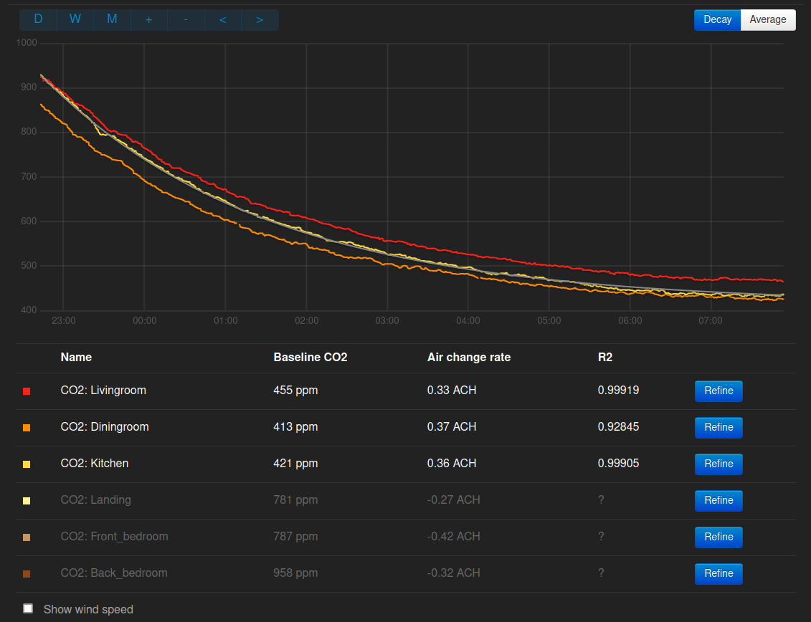
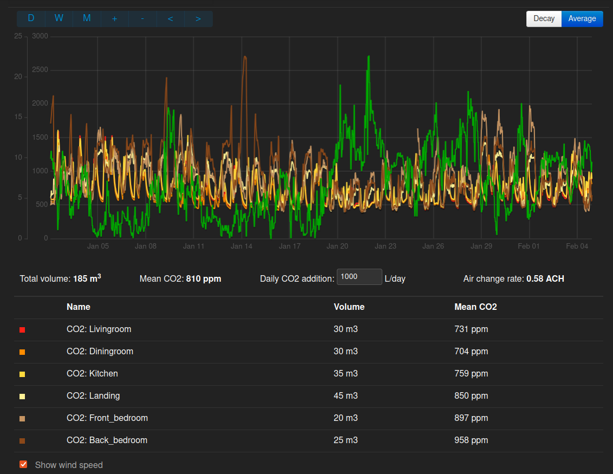
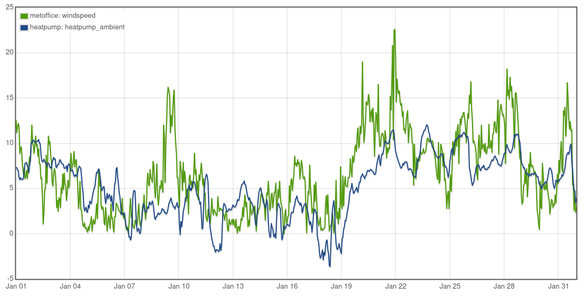

# Measuring air change rates with CO2 sensors

## Decay method

To be added soon...

## Averaging method

Another way of measuring the air change rate in a building is to use the formula described by Michael de Podesta in his [blog on the subject](https://protonsforbreakfast.wordpress.com/2021/06/06/estimating-rates-of-air-change-in-homes).

Where:

- The CO2 production rate in litres per hour
- Room volume, e.g. 180 m3 = 180,000 litres.
- 10-6 is just a shorter way of writing 0.000001
- c is the room/building CO2 concentration in parts per million (ppm)
- c0 is the outdoor CO2 concentration e.g. 420 ppm

Michael gave an example of using this formula for a spot CO2 reading but it’s also possible to use it with measurements of average CO2 levels in a building e.g. over a day or several days. 

To do this we just enter the average CO2 production rate in at the top and average building CO2 concentration’s in place of parameter c [2]. 

This presents us with two key challenges:

1. How do we accurately measure average  CO2 concentration in a building?
2. How do we accurately estimate the average CO2 production rate?

The first can be achieved with multiple (as many as possible..) data logging or internet connected CO2 sensors. The  CO2 concentration from each sensor needs to be recorded every 1-5 minutes, with these averaged over the period of interest. A building average can then be calculated by weighting each sensor average by the air volume it represents.

The second can’t be measured (easily..) and so needs to be estimated based on the typical activity patterns of the building occupants. A convenient way of calculating the average amount of CO2 that the people in a building add per hour by breathing is to calculate the total  CO2 production rate into the building over the period of a day (L/day) and then divide by 24 to give an hourly average. This makes it easier to take into account variations in the rate at which we produce CO2. We produce much more CO2 per hour when cooking, cleaning the house or dancing vs sitting on the sofa or sleeping..

A useful paper linked in Michael’s piece gives CO2 production rates for a range of activities, gender and age. While the values are presented quite clearly in that paper it’s still quite look up all the values and add them together for a range of activities, times and occupants through out a day.

To make this process easier we have put together a tool that includes an occupant activity schedule builder. The default example when you open the tool is for a family of four. This range of activities listed results in just over 1000 L/day of CO2 production: 

[https://openenergymonitor.org/tools/co2_sim.html](https://openenergymonitor.org/tools/co2_sim.html)

A day with occupants:

- Out during the day gives ~700 L/day
- In all day gives ~1300 L/day
- Out for part of the morning or afternoon gives ~1000 L/day

Use this tool to estimate the likely range and average figure for the building that you are measuring.

## Real world example

Data from six CO2 sensors were collected throughout January 2024 for a mid-terrace, solid stone house. By weighting the average CO2 concentration from each sensor according to the volume it represents, the overall average CO2 concentration was determined to be 810 ppm.

Using the equation presented earlier we can work out the average air change rate for this period using the central estimate for daily CO2 additions as:

    (1000 L/day / 24) / ((185 m3 x 1000) x 0.000001 x (810 - 420)) = 0.58 ACH

We can test the sensitivity of this result to errors in our CO2 production range assumptions by entering the low end 700 L/day figure and the high end 1300 L/day figure:

    (700 L/day / 24) / ((185 m3 x 1000) x 0.000001 x (810 - 420)) = 0.40 ACH
    (1300 L/day / 24) / ((185 m3 x 1000) x 0.000001 x (810 - 420)) = 0.75 ACH

We can also test the sensitivity of the average CO2 concentration figure, how much difference would it make if the actual concentration was 100ppm higher or lower?

    (1000 L/day / 24) / ((185 m3 x 1000) x 0.000001 x (710 - 420)) = 0.77 ACH
    (1000 L/day / 24) / ((185 m3 x 1000) x 0.000001 x (910 - 420)) = 0.46 ACH

Combining both the range of daily CO2 additions and fairly wide range for the concentrations gives: 

    (700 L/day / 24) / ((185 m3 x 1000) x 0.000001 x (910 - 420)) = 0.32 ACH
    (1300 L/day / 24) / ((185 m3 x 1000) x 0.000001 x (710 - 420)) = 1.0 ACH

It’s more likely that our result and error is 0.6 +- 0.2 ACH rather than this wider range but either way this at least gives us a clear indication that the whole house air change rate for January was likely less than 1.0 ACH.

As a comparative reference: 

- The worst case air change rate for this house based on pre-2000 CIBSE guidance comes out to an equivalent of ~1.7 ACH (bathroom at 3.0, bedrooms at 1.0 etc). 
- The blower door test result divided by 20 suggested 0.43 ACH.

### Investigating windy periods

The green line on the emoncms CO2 monitor app screenshot shows the wind speed for a near by village from the metoffice. A high wind speed storm came through January 20th to the 23rd and the CO2 concentration levels can be seen to be clearly depressed during this period at 602 ppm. Plugging the numbers into the equation we can see that this period results in significantly higher air change rates, double the January average:

    (1000 L/day / 24) / ((185 m3 x 1000) x 0.000001 x (602 - 420)) = 1.24 ACH

January 4th to the 7th was a period of lower wind speeds and higher CO2 levels:

    (1000 L/day / 24) / ((185 m3 x 1000) x 0.000001 x (988 - 420)) = 0.40 ACH

It’s clear that the air change rate in this house is heavily affected by wind speeds. A concerted effort to seal up draught points and introduce controlled ventilation instead would probably be worthwhile!

From a heat loss perspective high wind speeds during winter are usually correlated with higher outside temperatures. In the cold period 17th to the 18th of January the average outside temperature was -1C, the wind speed was 1.7 m/s, by the time wind speeds peaked at 15.4 m/s on the 21st of January the outside temperature had risen to 9C!

The heat loss from 185 m3 of air being changed at a rate of 0.6 ACH with a DT of 23K between outside and inside is `0.336 x 0.6 ACH x 185m3 x 23K = 858W`. At 1.24 ACH and a DT of 11K the heat loss is 848W. A neat example of how higher wind speeds and higher outside temperatures can result in the same heat loss as a period of low wind speeds and below zero outside temperatures.

High wind speeds don't always correlate with high outside temperatures of course. The infamous ‘beast from the east’ weather pattern can deliver both high wind speeds and low temperatures, heat loss from high air change rates in these conditions could push up to `0.336 x 1.24 ACH x 185m3 x 23K = 1772W` for this property.

It could be argued that catering for high wind, low temperature conditions with the heat pump is less important than achieving overall higher system performance in more typical conditions. Some heat pumps perform less well than others when over-sized. Over-sizing a heat pump just to deal with a few days in a 1 in 5 year event might not be worthwhile. Perhaps a simple plug in electric heater could be used to top up during these conditions given that high wind will also mean large amounts of low carbon wind power generation?

To be discussed after the next ‘beast from the east’?

---

[1] https://protonsforbreakfast.wordpress.com/2021/06/06/estimating-rates-of-air-change-in-homes

[2] Formula validated for use with average values using the CO2 simulation tool. 

[3] Carbon dioxide generation rates for building occupants Persily A, de Jonge L. Indoor Air. 2017;27:868–879. https://doi.org/10.1111/ina.12383
