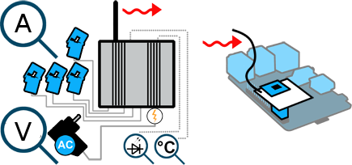
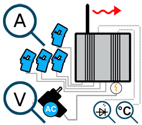
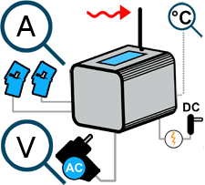
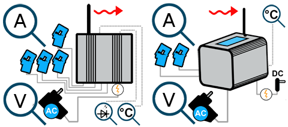

# System Overview

The OpenEnergyMonitor system has the capability to monitor electrical energy use / generation, temperature and humidity.

The units below can be configured to work for a variety of applications. The system is fully open-source, both hardware and software. All hardware is based on the [Arduino](http://www.arduino.cc/) and [Raspberry Pi](http://raspberrypi.org) platforms.

% 

<p><b>Current system</b></p>

The emonTx4, emonPi2 and emonTx5 are all part of the same AVR-DB hardware family and share the same core electricity monitoring functionality including: 6x CT channel electricity monitoring as standard (expandable to 12 CT's with an expansion board) and both single and full three phase voltage sensing support. The emonPi2 and the emonTx5 share the same measurement board, which is itself a minor evolution of the emonTx4 design, this is mostly a change of layout to support the integration of a RaspberryPi in the same enclosure for the emonPi2.

```{image} img/emonpi2-min.png
:width: 50px
:align: left
```

**emonPi2:**<br>A 6x channel electricity monitor with an integrated Raspberry Pi in the same enclosure. Temperature sensing and RFM69 433 Mhz radio receiver handled directly by the Raspberry Pi. Hosts the emonCMS software for local data logging and visualisation.<br><br>

```{image} img/emontx5-min.png
:width: 50px
:align: left
```

**emonTx5 (available soon):** A 6x channel electricity monitoring node. Transmits data via an inbuilt 433MHz radio to an emonPi or emonBase. Great for expanding an emonPi2 monitoring setup where more CT inputs are required either in the same location or in a different part of the building.<br><br>

```{image} img/emontx4-min.png
:width: 50px
:align: left
```

**emonTx4:** The original 6x circuit energy monitoring node. Transmits data via an inbuilt 433MHz radio. While no longer available in the shop the emonTx4 is still actively supported under the current generation of AVR-DB hardware.<br><br>

---

```{image} img/emonth-min.png
:width: 50px
:align: left
```
**emonTH2:** A battery powered, wireless, room based temperature & humidity monitoring node. Transmits data via 433MHz radio to an emonBase or emonPi.
<br><br>

```{image} img/emonbase-min.png
:width: 50px
:align: left
```
**emonBase:** A Raspberry Pi base-station that receives data sent from an emonTx4/5 and emonTH radio nodes. Can be used instead of an emonPi2 where the installation favours locating these in different parts of a building. Hosts the emonCMS software for local data logging and visualisation.
<br><br>

```{image} img/emoncms-min.png
:width: 50px
:align: left
```
**emonCMS:** An open-source web application, for processing, logging and visualising energy, temperature and other data. Runs locally on the emonPi and emonBase, also available remotely via emoncms.org.
<br>

```{image} img/ctsensor.png
:width: 50px
:align: left
```
**CT sensor:** Current transformer. Used for measuring AC current. We use a non-invasive clip-on sensor for ease of installation and safety.
<br><br>

```{image} img/emonVs-min.png
:width: 50px
:align: left
```
**emonVs:**<br>Combined precision voltage sensor and power supply, sends voltage data and power to the emonPi2 and emonTx5 via RJ45.<br><br>
<br><br>

---

<p><b>Timeline</b></p>

Open Energy Monitor has developed and evolved different hardware solutions overtime:

```{image} img/timeline.png
:width: 500px
:align: center
```

<!-- 
Invisible section: Contains source code for the image above using https://playground.diagram.codes/d/timeline
    width=700
    "2010-2011": "emonTx1️"
    "March 2012": "emonTx2\nemonGLCD\nemonBase"
    "April 2012": "First Heat\nPump\napplication\n♨️"
    "October 2012": "NanodeRF"
    "November 2013": "emonTx3 v3.2\emonTHv1/EmonTX Shield"
    "February 2015": "RFM69Pi3"
    "April 2015": "emonPi1"
    "2016": "emonTx3 v3.4"
    "November 2016": "emonTH2"
    "~2017": "OpenEVSE\nEmonVSE\n🚙"
    "October 2017": "IotaWatt"
    "March 2020": "OVMS"
    "November 2022": "emonTx4"
    "December 2023": "emonPi2"
    "Future": "🔮"
    "Summer 2024": "emonTx5"
    "2025": "emonPi3 & emonTx6" 
-->

---

<p><b>Earlier hardware</b></p>

```{image} img/emonpi-min.png
:width: 50px
:align: left
```
**emonPi:** An all in one 2 circuit energy monitor and base-station which collects data, hosts the emonCMS software and can also receive data from other sensor nodes.<br><br>

```{image} img/emontx-min.png
:width: 50px
:align: left
```
**emonTx V3.4:** A 4 circuit energy monitoring node. Transmits data via an inbuilt 433MHz radio to an emonBase or emonPi. It can also send data via an ESP8266 WiFi adapter or directly by a serial connection.<br><br>

```{image} img/voltagesensor.png
:width: 50px
:align: left
```
**ACAC Voltage sensor:** An AC-AC Voltage adapter, used for measuring AC Voltage safely. Used in conjunction with the AC current measurement to calculate power consumption accurately.
<br><br>

---

<!--
## Example configurations


**emonTx + emonBase**<br>
Separate sensor node and base station linked by 433MHz radio, 4x CT sensor inputs, 1x ACAC Voltage sensor input, temperature and pulse input. RaspberryPi Base station with emonCMS for local data logging. Wifi or Ethernet connectivity. Applications: Home solar, consumption, multiple circuits, 3-phase.



*New 2019: emonTx firmware supports higher accuracy continuous monitoring.*

**[Installation Guide](/setup/install-emontx)** \| **[emonTx Technical](/technical/emontx)**<br> **View in Shop: [emonTx](https://shop.openenergymonitor.com/emontx-v3-electricity-monitoring-transmitter/) & [emonBase](https://shop.openenergymonitor.com/emonbase-web-connected-base-station/)**

---

**emonTx + ESP8266 WiFi**<br>
Using and ESP8266 WiFi Adapter the emonTx can send data directly to a remote emonCMS server such as emoncms.org. It is also possible to use an ESP8266 WiFi adapter with an emonTx to send data to an emonPi or emonBase to improve reliability where 433MHz is not sufficient.



*Note: Without local data logging this approach can incur additional service costs via the remote server.*

**[Installation Guide](/setup/esp8266-adapter-emontx/)** \| **[emonTx Technical](/technical/emontx)**<br>**View in Shop: [emonTx + WiFi Adapter](https://shop.openenergymonitor.com/emontx-wifi-adapter-1/)**

---

**emonPi**<br>
All in one energy monitor. 2x CT sensor inputs, 1x ACAC Voltage sensor input, temperature and pulse input, LCD Display. Integrated RaspberryPi with emonCMS for local data logging. Wifi or Ethernet connectivity. Designed for single phase home solar and monitoring energy consumption.



**[Installation Guide](/setup/install)** \| **[emonPi Technical](/technical/emonpi)** \| **[View in Shop](https://shop.openenergymonitor.com/emonpi-3/)**

---

**emonTx + emonPi**<br>
It also possible to add one or more emonTx units to an emonPi to gain additional CT sensor inputs.



*Note: sensor node transmit timing is not synchronised and so packet collisions increase with the number of nodes. In practice we recommend not more than 10 nodes per base station.*

**[emonPi Installation Guide](/setup/install) [+ Add Additional emonTx](/setup/emontx/)** \| **[emonPi Technical](/technical/emonpi)** \| **[View in Shop](https://shop.openenergymonitor.com/emonpi-3/)**

## Example Applications

- [Home Energy Monitor](/applications/home-energy/)
- [Solar PV](/applications/solar-pv/)
- [Heatpump Monitoring](/applications/heatpump/)

## Choosing a system configuration

**1. How many AC circuits do you wish to measure?**<br>
The basic emonPi configuration supports 2x CT sensor inputs. A basic emonTx + emonBase configuration supports 4x CT sensor inputs. Both configurations can be extended to increase the number of CT inputs by adding additional emonTx units (4x CT sensor inputs per emonTx).

**2. Is the system single phase or 3 phase?**<br>
Our units are primarily designed for single-phase operation, however the emonTx can be configured for 3 phase energy monitoring with 3-phase firmware. This firmware measures the current on all three phases but only voltage on the first phase. See [emonTx 3-Phase Firmware](https://github.com/openenergymonitor/emontx-3phase) for full details. An emonTx can support one set of 3-phase measurements, for applications requiring 3-phase measurement of multiple circuits e.g 3 phase SolarPV & Grid Import/Export, multiple emonTx units will be required.

**3. Do you have an AC Socket nearby for power supply and an ACAC Voltage sensor?**<br>
The emonPi requires an AC socket near the meter cabinet both for power and to provide an AC voltage signal. The emonTx also gives best results if used with an AC voltage sensor. If the meter location does not have an accessible AC socket and its not possible to install a socket; it is possible to power the emonTx with batteries and measure AC current only and calculate an approximate apparent power measurement. Select ['3 X AA Battery Holder' under the power supply section when buying an emonTx](https://shop.openenergymonitor.com/emontx-v3-electricity-monitoring-transmitter/) for this option. Note that the discreet sampling firmware will be installed which puts the emonTx to sleep between readings to extend battery life.

**4. Ethernet or WiFi for connectivity?**<br>
Both the emonPi and emonTx + emonBase systems support WiFi and Ethernet provided by the RaspberryPi. To use Ethernet with the emonPi, ethernet is required at the metering location. The emonTx + emonBase configuration allows for separation of the metering location and the base station which can be located next to your internet router.

**5. Number of room temperature and humidity sensors required**<br>
Both the emonPi and emonBase based systems support receiving data from up to 30 wireless 433MHz radio nodes, including multiple emontx units and emonTH temperature and humidity nodes.

**6. Wired temperature sensing with RJ45 DS18B20 sensors**<br>
Both the emonPi and emonTx support wired temperature sensing using the RJ45 socket. The emonTx includes a terminal block for DS18B20 sensors without the RJ45 plug. The terminal block can also be used for the pulse input.

**7. Pulse counting?**<br>
Both the emonPi and emonTx support a single pulse counting input using the RJ45 socket.

**8. How important is having a basestation status display to you?**<br>
The emonPi includes an LCD Display for easy access to the emonPi network IP address. This can simplify setup on networks where hostnames are unreliable. The emonBase does not include an LCD display and so requires either the hostname to work (e.g emonpi.local) or device detection using the routers device list or using tools such as [Fing Android](https://play.google.com/store/apps/details?id=com.overlook.android.fing&hl=en_GB) or [Fing iOS](https://itunes.apple.com/gb/app/fing-network-scanner/id430921107?mt=8).

For further Q&A you may find the [community forum FAQ](https://community.openenergymonitor.org/t/frequently-asked-questions/3005) useful.
-->
